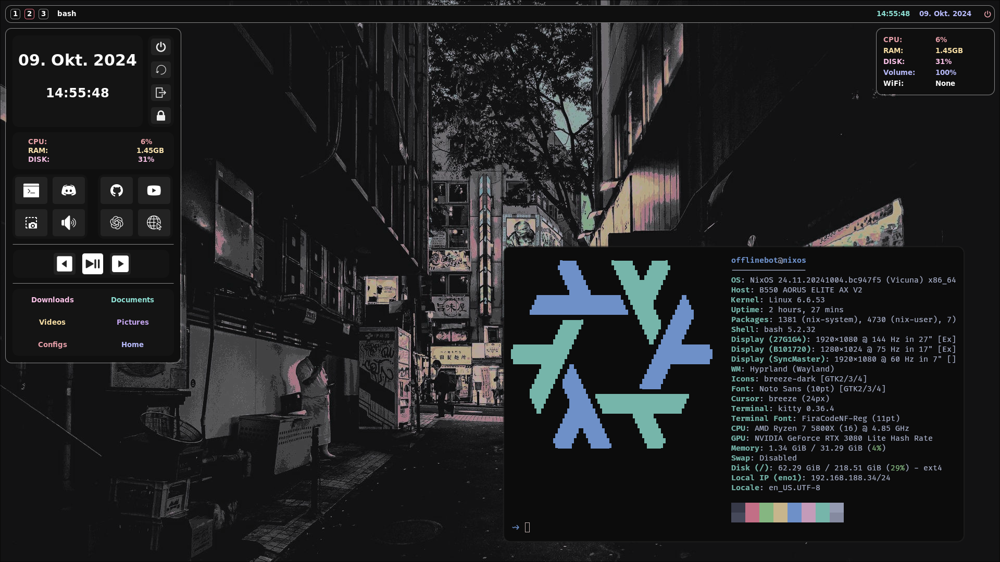

My full NixOS setup for my PC and Laptop.

# IMPORTANT
the whole setup is moving to another branch called `main`!  
so this is not going to be updated and will stay like this

## How to install:
To use my NixOS setup simply clone this repo: 

`git clone -b testing https://github.com/OfflineBot/nixos.git` 

and put the contents into a folder where its easily accessible. what i always do: 

`mkdir -p ~/System`  
`cp ./nixos/* ~/System`

the home-manager standalone is required for my setup so follow this installation guide for standalone home-manager:  
(remember using sudo to install)

<a href="https://nix-community.github.io/home-manager/index.xhtml#sec-install-standalone">Standalone Home-Manager</a>

now everything should be setup for usage!

## How to use hardware configuration:
For the main configuration.nix: 

`cd ~/System/nixos`  
`sudo nixos-rebuild switch --flake .#laptop`

here `#laptop` is used but there is also a config for `#pc` by simply replacing the `#laptop` with `#pc`.

my `#pc` setup: 
- 3 monitors (weird configuration and probably required to change that)

my `#laptop` setup:
- 1 monitor (fullhd 60hz)

for testing this out and with no idea of how to use nix language or hyprland config just use `#laptop`.

## How to use home-manager:
For the home-manager: 

`cd ~/System/home-manager`  
`home-manager switch --flake .#laptop`

like in hardware configuration:  
here `#laptop` is used but there is also a config for `#pc` by simply replacing the `#laptop` with `#pc`.

for testing this out and with no idea of how to use nix language or hyprland config just use `#laptop`.

### Add packages:
For downloading packages simply learn nixos :)  
one weird thing is in home-manager. to install packages dont use home.nix (which is standard and still there).  
the `~/System/home-manager/system/default.nix` is used as the home.nix

## whats missing:
- i want to add the sddm theme management into configuration.nix so its not manually managed.

## Current look:

